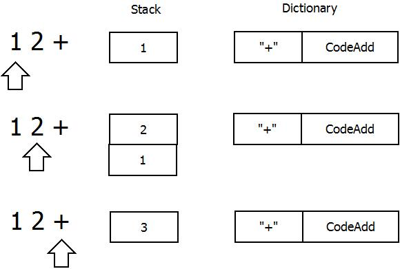
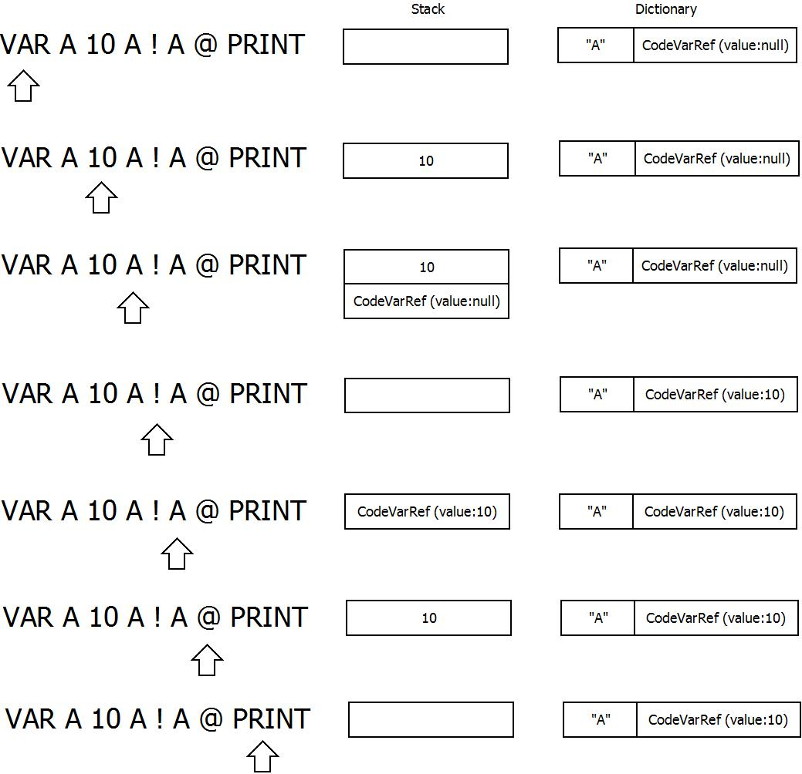
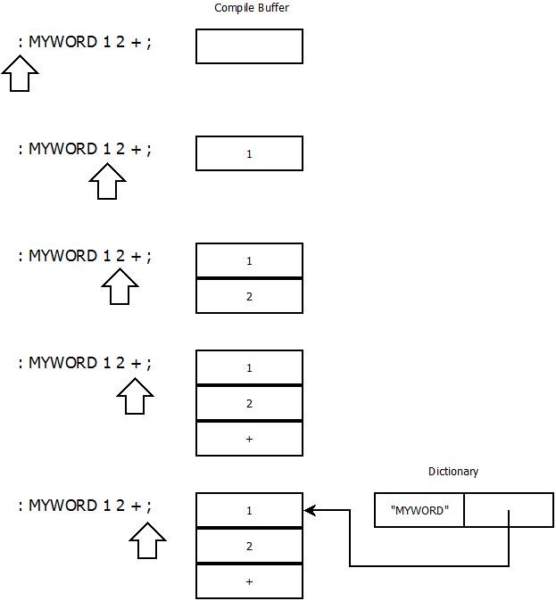
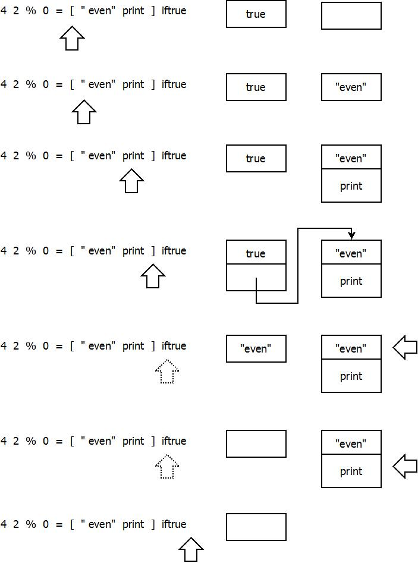

# 単純なインタプリタの作成

単純なインタプリタを実際に作ることで、プログラミング言語処理系の基礎を復習する。

## 選定

単純なインタプリタというと、いくつか候補があげられる：

+ 行番号付BASIC
+ Lisp
+ Forth

行番号付BASICは、字句解析に再帰下降構文解析を使うことが多いが、関数定義および関数呼び出しが省かれることが多く、実用性もいまひとつなので選定から外した。

[uBASIC](http://dunkels.com/adam/ubasic/) by Adam Dunkels

Lispは字句解析が単純で実用性もあるが、基礎の復習という点ではいい資料が見つからなかった。

[(How to Write a (Lisp) Interpreter (in Python))](http://norvig.com/lispy.html) by Peter Norvig

Forthは字句解析が単純で実用性もあり、いい資料を見つけることができたので今回採用するに至った。

[Make Your Own Programming Language](http://scratch-lang.notimetoplay.org/) by Felix Pleşoianu

## Forth

Forthというプログラミング言語は、今となってはかなりマイナーな言語ではあるものの、Open Firmwareといったハード寄りのドメインでは今でも使われている。

Forthの最大の特徴は、逆ポーランド記法と呼ばれる構文にある。C言語のような言語では加算は次のように記述される：

```
1 + 2
```

一方、Forthでは次のように記述する：

```
1 2 +
```

Forthのもう１つの大きな特徴は、スタック指向という点である。スタック指向は、先述の逆ポーランド記法と表裏一体であり、この２つによってForthの字句解析が単純なものとなっている。

## Javaによる移植

プログラミング言語処理系の基礎を復習する手段として、先にあげた資料の中でJavaScriptで記述された実装をJavaに移植することとした。JavaScriptは動的型言語であり、一方Javaは静的型言語である。その差異を乗り越えて移植することで、実装を深く理解することが可能だと考えた。

## Scratch

今回取り上げるForthの処理系は、JavaScriptで書かれたScratchというものである。ForthといってもANSIのような標準に従ったものではなく、独自の文法を持ち、かなり単純化されたものとなっている。

今回参考にする資料はチュートリアル形式になっている。第１段階の実装から徐々に複雑になり第４段階で終了となる：

+ 第１段階：単純な字句解析と四則演算
+ 第２段階：字句解析拡張による文字列対応と変数の導入
+ 第３段階：ユーザ定義サブルーチン
+ 第４段階：制御構造

## 移植
以降、JavaScript版の実装の特徴と、Javaに移植する上でのポイントについて記述する。

### 第１段階

Javaに移植するに当たって、スタックにはjava.util.Stackを用いた。java.util.Stackはpop, pushといったメソッドを持つので移植が容易になる。

Stackの用い方としては、double型やString型といった様々な型のオブジェクトが要素となるので、テンプレート型は指定しない。

一方、辞書してはHashMapを用いるが、こちらはキーと値が明白なのでテンプレート型を<String, Code>とした。

JavaScript版ではプリミティブワードの実装として関数オブジェクトが用いられているが、JavaではCodeクラスを導入して差異を吸収した。

```java
abstract class Code {
    public abstract void call(Scratch1 terp);
}

class CodeAdd extends Code {
    @Override
    public void call(Scratch1 terp) {
        if (terp.stack.size() < 2) {
            throw new RuntimeException("Not enough items on stack");
        }
        double tos = (double)terp.stack.pop();
        double _2os = (double)terp.stack.pop();
        terp.stack.push(_2os + tos);
    }
}
```

#### 実行例

次のようなソースコードを例に考える：

```
1 2 +
```

処理系は、ソースコードの先頭から処理をはじめる。

+ 「1」は(辞書に登録されてなく)数値なので数値1に変換してスタックに積む。
+ 「2」も同様に数値2をスタックに積む。
+ 「+」は辞書に登録されているので、辞書からCodeAddのインスタンスを引き出し実行(call)する。
+ 結果として3がスタックに残される。



### 第２段階

第２段階のポイントは変数の実装である。JavaScript版ではクロージャを巧みに使って実現されている：

```javascript
function makeVariable(terp) {
    var me = {value: 0};
    return function () { terp.stack.push(me); };
}

"VAR": function (terp) {
    var var_name = terp.lexer.nextWord();
    if (var_name == null) throw "Unexpected end of input";
    terp.define(var_name, makeVariable(terp));
},
```

クロージャをJavaで素直に実装すると、やはりCodeオブジェクトということになる：

```java
class CodeVarRef extends Code {
    public Object value;

    @Override
    public void call(Scratch2 terp) {
        terp.stack.push(this);
    }
}

terp.define(const_name, new CodeConstRef(const_value));
```

#### 実行例

```
VAR A      // 変数定義 辞書に(空の)エントリを作る
10         // 10をスタックに載せる
A          // スタックに辞書のエントリを載せる
!          // エントリに値を格納する
A          // スタックに辞書のエントリを載せる
@          // エントリから値を引き出す
PRINT      // 値を印字する
```



### 第３段階

第３段階ではユーザ定義ワード(サブルーチン)が導入される。第４段階で扱われる制御構造とともに、言語処理系のポイントの１つでもある。

ここでForth特有のインタプリタモードとコンパイルモードという仕組みが登場する。Forth処理系は、起動時にはインタプリタモードに置かれる。インタプリタモードでは、その名のとおり、入力されたソースコードを逐次評価していく。しかし、「:」によってワード定義がはじまると、インタプリタモードからコンパイルモードに移行する。

処理系がコンパイルモードに移ると、入力されたソースコードは、コンパイルされる(Codeオブジェクトへの変換される)ものの、すぐに実行されることはなく、ワード定義が終わるまで配列に溜められていく。溜まったワードの配列は、ワード定義の中に保持される。

ユーザ定義ワードの導入に合わせて、「イミディエイト」という仕組みも導入されている。イミディエイトワードとは、「たとえコンパイルモードにあっても即座に評価する」という特殊なワードであり、ワード定義の終了を意味する「;」が例の１つである。

ユーザ定義ワードの実行は、そのワード定義が持つ配列を用いて実行される。実行に当たっては、そのワード定義が独自に管理するIP (インストラクションポインタ)が用いられる。ユーザ定義ワードの実行がはじまると、現在のIPが退避され、ユーザ定義ワードが持つIPがセットされる。そして、ユーザ定義ワードの実行が終わったら、退避しておいたIPに戻される。このような仕掛けによって、ユーザ定義ワードの呼び出しを何重にもネストすることが可能となる。



### 第４段階

第４段階では、分岐やループといった制御構造が導入される。ただし、Scratchでは、通常のForthと異なる文法／実装が紹介されている。

Scratchでは、制御構造を実現するためにリストが導入されている。このリストは次のように記述される：

```
[ 1 PRINT ]
```

このソースコードを評価すると、処理系があたかもコンパイルモードにあるかのように、コンパイルされたワードが配列に溜まっていく。

条件分岐としては、スタックに載せてある真偽値をもとに、配列に溜まったワードを実行するかどうかを決めればよい。

```
4 2 % 0 = [ " even" print ] iftrue  // if (4 % 2 == 0) { puts("even"); }
```



## 考察

一般的なForthでは、ユーザ定義ワード実行(他の言語におけるサブルーチン呼び出し)や制御構造を実現するためにはリターンスタックが用いられる。今回取り上げたScratchでは、リターンスタックを用いず、実装言語によるスタックを利用してワード実行や制御構造を実現している。これによって実装が単純になるというメリットがある。

また、第４段階でも述べたように、Scratchではリストを導入することで制御構造を実現している。これにはリターンスタックが不要になるという他にも、ユーザ定義ワードの処理を流用することによって実装が単純になるというメリットがある。

実装の問題点としては、publicなインスタンス変数が多く使われていることがあげられる。これを解決するには、Codeクラス群の処理をScratch内に移すか、Codeクラス群をScratchの内部クラスにすることが考えられる。

## まとめ

「本格的な」処理系としては物足りなさが残るものの、単純なインタプリタを実装することで、プログラミング言語処理系の基礎を復習するという目的は達成できた。

今後の展望としては、機会があればコンパイラに挑戦したい：

[Let's Build a Compiler](http://compilers.iecc.com/crenshaw/) by Jack Crenshaw
